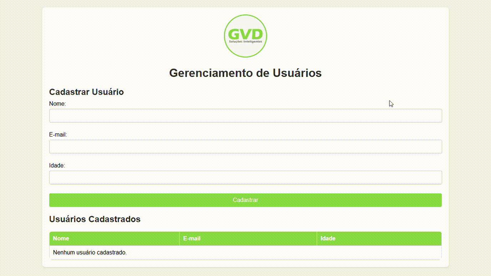

# Teste PHP

### Aplicação em Execução

### Objetivo

Esta aplicação permite cadastrar e listar usuários com validações básicas.

### Requisitos

- PHP 7.4 ou superior.

### Como Executar

1. Clone o repositório.
2. No terminal, navegue até o diretório do projeto.
3. Execute: `php -S localhost:8000` e clique no link http.

### Funcionalidades

- Cadastrar usuários com nome, e-mail e idade.
- Listar usuários cadastrados.
- Validações:
  - Todos os campos são obrigatórios.
  - E-mail deve ser único.
  - Idade deve ser maior que 0.

### Comentários Adicionais

- O formulário no index.php usa o atributo required nos campos name, email e age, garantindo a obrigatoriedade de preenchimento.
- O método addUser na classe UserManager verifica se o e-mail já existe no array $users antes de cadastrar o usuário. Caso contrário, lança uma exceção, garantindo que o e-mail sejá único.
- O método addUser na classe UserManager verifica se a idade é maior que 0. Caso contrário, lança uma exceção e garante que a idade deve ser maior que 0.
- O array $users na classe UserManager armazena os usuários enquanto a aplicação está ativa, o que cumpre o requisito de armazenamento em memória.
